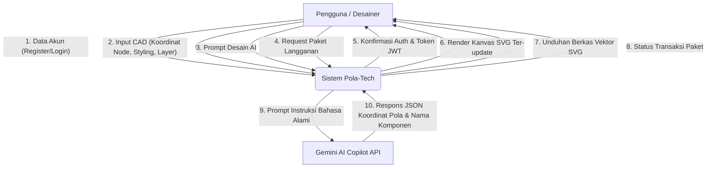
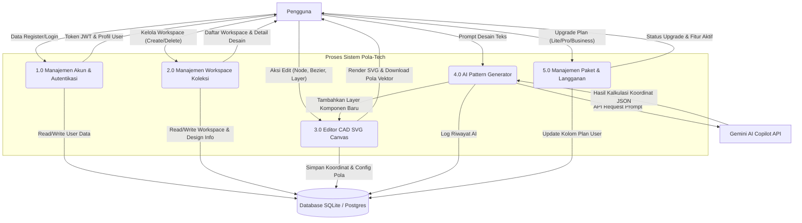
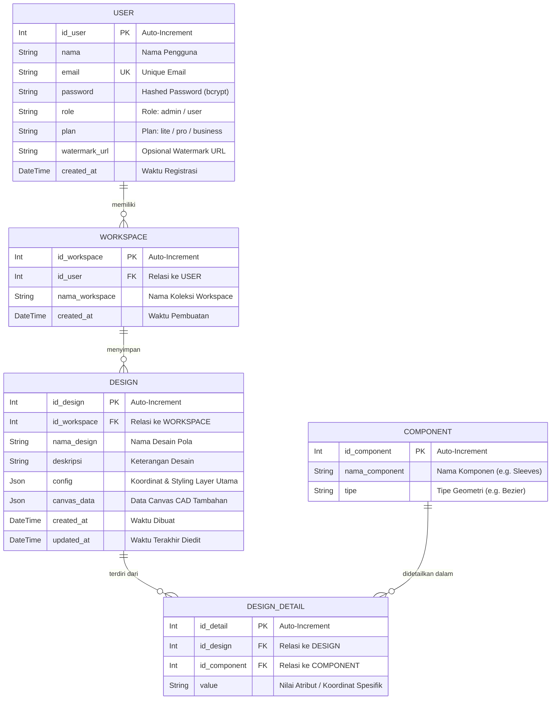

# 📰 Pola-Tech: Platform Interaktif Desain Pola Busana (Fashion CAD)

**Pola-Tech** adalah sebuah platform pembuat pola busana interaktif berbasis CAD (Computer-Aided Design) digital. Platform ini dirancang khusus untuk membantu penjahit, pelajar fesyen, butik pakaian, desainer indie, dan UMKM konveksi dalam mentransformasi sketsa manual menjadi cetakan pola busana digital berformat vektor (SVG/PDF) secara instan, cepat, dan presisi.

---

## 🛠️ Analisis Kebutuhan Sistem (User Requirements)

### 1. Kebutuhan Fungsional (Functional Requirements)
- **F-01: Manajemen Akun & Autentikasi**
  Sistem harus dapat mendaftarkan akun baru (Register) dan memvalidasi kredensial pengguna (Login) secara aman dengan password terenkripsi.
- **F-02: Manajemen Workspace**
  Pengguna dapat membuat, melihat daftar, dan menghapus workspace untuk mengorganisir koleksi proyek busana yang sedang dikerjakan.
- **F-03: Editor CAD Canvas Interaktif (SVG Visualizer)**
  Pengguna dapat memanipulasi pola pakaian secara visual langsung di kanvas:
  - Menambah, menggeser, dan menghapus titik koordinat (Vertex/Node).
  - Membengkokkan garis lurus menjadi kurva lengkung menggunakan kontrol bezier kuadratik (`Q`).
  - Menambahkan bentuk geometri dasar (Garis, Persegi, Segitiga, Pentagon, Hexagon, Dekagon, Lingkaran) sebagai template layer baru.
  - Melakukan duplikasi layer, rotasi 90 derajat, pencerminan horizontal (Mirror), dan mengubah urutan z-index layer.
- **F-04: Pengaturan Properti Pola (Styling)**
  Pengguna dapat mengatur nama layer, warna isi (Fill Color), warna garis tepi (Stroke Color), ketebalan garis (Stroke Width), tingkat transparansi (Opacity), dan radius lingkaran.
- **F-05: AI Pattern Copilot (Gemini Integration)**
  Pengguna dapat menulis instruksi dalam bahasa alami (misal: *"Saku berbentuk kotak di dada kiri"*) untuk dihitung koordinatnya secara otomatis oleh AI Copilot dan digambar instan pada canvas CAD.
- **F-06: Ekspor & Cetak Pola**
  Pengguna dapat mengunduh hasil akhir pola digital dalam format grafik vektor SVG skala presisi tinggi untuk dicetak.
- **F-07: Manajemen Paket Langganan**
  Pengguna dapat memilih dan meningkatkan status lisensi paket (LITE, PRO, atau BUSINESS) secara langsung pada platform.

### 2. Kebutuhan Non-Fungsional (Non-Functional Requirements)
- **NF-01: Performa Rendering Kanvas**
  Kanvas CAD harus merespons manipulasi titik (drag-and-drop) secara real-time dengan latency di bawah 16ms menggunakan manipulasi DOM SVG.
- **NF-02: Keamanan Data**
  Password pengguna harus disimpan dengan enkripsi satu arah yang aman (`bcrypt`), dan transaksi request API dilindungi oleh otorisasi token JWT (JSON Web Token).
- **NF-03: Portabilitas & Responsivitas**
  Platform harus dapat diakses secara lancar melalui browser modern (Chrome, Edge, Firefox, Safari) dengan tata letak grid dan flexbox yang responsif.
- **NF-04: Integritas Database**
  Sistem database harus menjamin relasi data yang konsisten (Cascading Delete) antara User, Workspace, Design, dan detail komponen pola.

---

## 📊 Data Flow Diagram (DFD)

### DFD Level 0 (Context Diagram)
Diagram ini menjelaskan aliran data global antara entitas luar (Pengguna & Gemini AI API) dengan Sistem Utama Pola-Tech.



### DFD Level 1
Diagram ini mendeskripsikan dekomposisi proses internal dari Sistem Pola-Tech menjadi 5 proses utama.



---

## 🗄️ Entity Relationship Diagram (ERD)

Database Pola-Tech dirancang menggunakan Prisma ORM dengan relasi tabel sebagai berikut:



---

## 🧪 Laporan Hasil Pengujian (Testing Report)

Pengujian sistem dilakukan menggunakan metode **Blackbox Testing** untuk memvalidasi seluruh fungsionalitas antarmuka dan respon API:

| ID Test | Modul / Fitur | Skenario Pengujian | Hasil yang Diharapkan | Status |
|---|---|---|---|---|
| **TS-01** | Autentikasi | Mendaftar akun baru dengan email unik dan password minimal 6 karakter. | Akun berhasil disimpan di DB dengan password terenkripsi, status sukses dikembalikan. | **PASS** |
| **TS-02** | Autentikasi | Login menggunakan email dan password yang terdaftar. | Sistem mengembalikan token JWT dan profil pengguna, lalu mengarahkan ke dashboard. | **PASS** |
| **TS-03** | Workspace | Membuat workspace baru bernama *"Koleksi Kebaya Modern"*. | Workspace baru berhasil dibuat dan langsung tampil di sidebar daftar workspace. | **PASS** |
| **TS-04** | Canvas CAD | Menambahkan bentuk dasar lingkaran (Circle) dan persegi (Rect). | Geometri dirender di dalam kanvas SVG dengan warna default. | **PASS** |
| **TS-05** | Canvas CAD | Men-drag titik vertex biru pada pola baju untuk memanipulasi bentuk. | Titik koordinat bergeser dan visualisasi pola SVG ter-render secara real-time. | **PASS** |
| **TS-06** | Canvas CAD | Menggeser titik control point bezier (titik abu-abu) pada garis pola. | Garis lurus bertransformasi secara mulus menjadi kurva lengkung bezier (`Q`). | **PASS** |
| **TS-07** | Canvas CAD | Melakukan *Double-Click* pada titik kontrol bezier kuning. | Garis kurva reset kembali menjadi garis lurus (`L`). | **PASS** |
| **TS-08** | AI Copilot | Memasukkan prompt *"saku di dada kiri"* ke form AI Pattern Copilot. | API backend memproses prompt melalui Gemini AI, menghitung koordinat, dan menggambar saku di koordinat x=30, y=40 secara otomatis. | **PASS** |
| **TS-09** | Ekspor Pola | Mengklik tombol *"Cetak Pola (SVG)"*. | File SVG dengan format skala 1:1 langsung terunduh secara lokal ke komputer pengguna. | **PASS** |
| **TS-10** | Langganan | Mengubah langganan pengguna menjadi paket *"PRO"* pada halaman landing page. | Kolom `plan` pada tabel `User` di database SQLite ter-update menjadi `"pro"`. | **PASS** |

---

## ⚙️ Panduan Instalasi & Cara Running Aplikasi (Lokal)

Proyek ini terbagi menjadi dua bagian: **Frontend (Next.js)** dan **Backend (Express.js + Prisma DB)**.

### 1. Prasyarat Sistem
Pastikan komputer Anda sudah terinstal:
- **Node.js** (Versi 18 ke atas)
- **npm** atau **yarn**

---

### 2. Jalankan Backend (Express.js)

1. Buka terminal baru dan masuk ke direktori backend:
   ```bash
   cd backend
   ```
2. Salin file konfigurasi env:
   ```bash
   cp .env.example .env
   ```
   *Secara default database telah terkonfigurasi menggunakan SQLite lokal (`DATABASE_URL="file:./dev.db"`).*
3. Instal semua dependencies backend:
   ```bash
   npm install
   ```
4. Setup skema database & seed data menggunakan Prisma:
   ```bash
   npm run db:generate
   npm run db:push
   npm run db:seed
   ```
   *Proses seeding akan menyisipkan akun demo: **`admin@polatech.id`** / password: **`password123`**.*
5. Jalankan server backend dalam mode development:
   ```bash
   npm run dev
   ```
   Backend akan berjalan di **`http://localhost:5000`**.

---

### 3. Jalankan Frontend (Next.js)

1. Buka terminal baru dan masuk ke direktori root proyek:
   ```bash
   cd /home/zeyn/Documents/PPl/pola-tech
   ```
2. Instal dependencies frontend:
   ```bash
   npm install
   ```
3. Jalankan server Next.js:
   ```bash
   npm run dev
   ```
4. Buka browser dan buka tautan berikut:
   **`http://localhost:3000`**

Aplikasi Pola-Tech siap Anda gunakan untuk mendesain pola busana digital!
